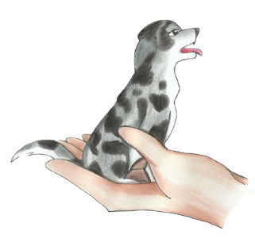

<p align="center">
  <a href="http://github.com/brunoocastro/pada-api" target="blank"></a>
</p>


  <h1 align="center">Projeto Amigo dos Animais - PADA</h1>
  <p align="center">An open-source project to facilitate pet adoption.</p>
    <p align="center">

## Help us

You can contribute with this project opening a pull-request

## **OBS: Before run, configure your env based on .env.example**

# Running locally

## Installation

```bash
# install project dependencies
$ npm install
```

## Start project

```bash
# development
$ npm run start

# watch mode
$ npm run start:dev

# production mode
$ npm run start:prod
```

# Running dockerd

```bash
# Coming soon
```

## Stay in touch

- Author - [Bruno "Tonelive" Castro](https://linked.in/brunoocastro)
- GitHub - [https://github.com/brunoocastro/pada-api](https://github.com/brunoocastro/pada-api)
- Twitter - [@otonelive](https://twitter.com/otonelive)
- Twitch - [@tonelive](https://twitch.com/tonelive)
